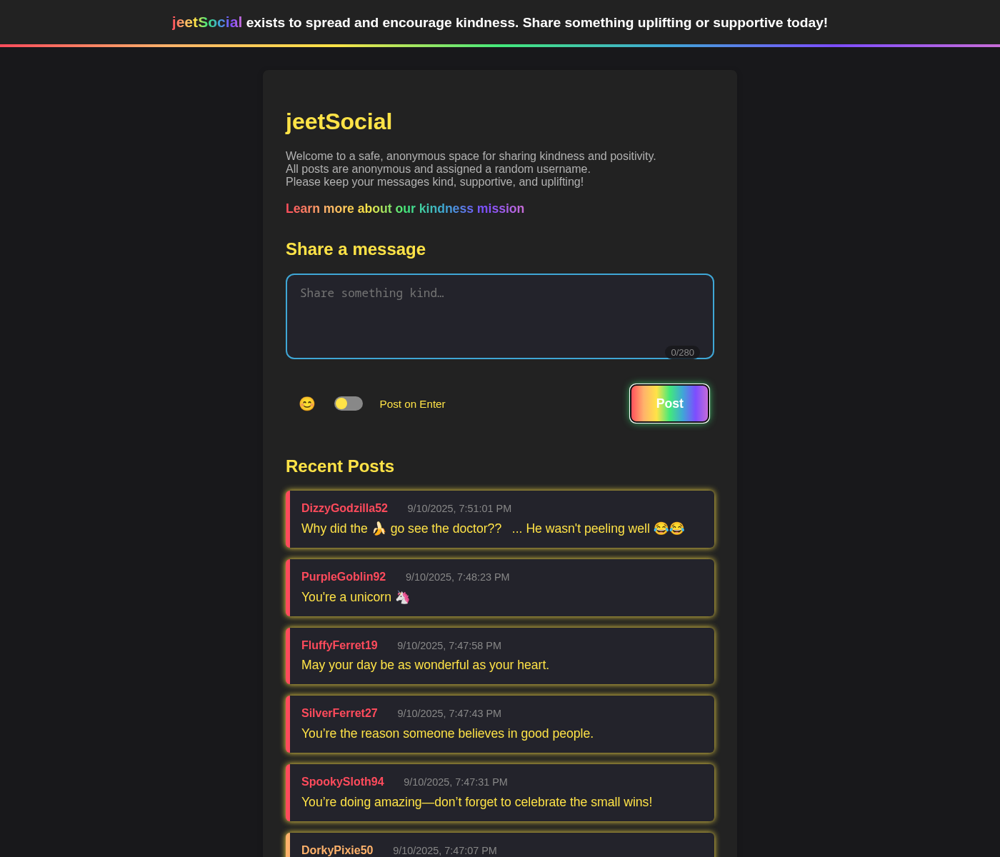

# jeetSocial



[](https://github.com/bigknoxy/jeetSocial/actions/workflows/ci.yml)
[](https://codecov.io/gh/bigknoxy/jeetSocial)
[](LICENSE)
[](https://www.python.org/downloads/release/python-3100/)
[](https://github.com/bigknoxy/jeetSocial/commits/main)
[](https://github.com/bigknoxy/jeetSocial/issues)

## Project Purpose & Kindness Mission
jeetSocial is a minimal, anonymous social platform designed to encourage kindness and privacy. All posts are anonymous and assigned random usernames. No personal data is collected, and all posts are filtered for hate speech using an extensive word/phrase list. The platform exists to spread and encourage kindness through anonymous sharing and support.

## Features
- Anonymous posting with random usernames
- 280 character limit per post (enforced in both frontend and backend)
- Hate speech filter (see `app/utils.py`)
- No personal data collection or tracking
- Rate limiting to prevent spam
- Docker Compose for robust deployment
- Kindness-focused UI/UX (includes live character counter and clear error messages for moderation, rate limiting, and character limit)
- **Fully responsive mobile UI** (optimized for touch, adapts to all screen sizes, accessible navigation and posting workflows)
- Feature flags for moderation, rate limiting, and experimental features
- Automated database migrations
- Comprehensive test suite (unit, integration, E2E)

## Quickstart / Onboarding

### Requirements
- Python 3.10.12 (local dev)
- Docker & Docker Compose (recommended)
- **Linux users:** You may need to run the following command before running `setup.sh` to install required build dependencies for Python:
  ```bash
  sudo apt-get install -y make build-essential libssl-dev zlib1g-dev \
    libbz2-dev libreadline-dev libsqlite3-dev wget curl llvm \
    libncurses5-dev libncursesw5-dev xz-utils tk-dev libffi-dev \
    liblzma-dev git
  ```

### Setup (Local Development)
You can set up your environment automatically with the provided script, or manually as before.

#### Option 1: Automated Setup (Recommended)
**Preferred for all new contributors.**

1. **Clone the repo:**
   ```bash
   git clone https://github.com/your-org/jeetSocial.git
   cd jeetSocial
   ```
2. **Run the setup script:**
   ```bash
   bash setup.sh
   ```
   - The script will check for [pyenv](https://github.com/pyenv/pyenv), prompt to install if missing, and set up the correct Python version (3.10.12).
   - It will create and activate a virtual environment, install all dependencies, and set up pre-commit hooks.
   - Your environment will match CI and Docker for maximum consistency.

**Troubleshooting pyenv/Python installation:**
- If you see errors about missing libraries or build failures:
  - **Linux (Debian/Ubuntu):** Run:
    ```bash
    sudo apt-get update
    sudo apt-get install -y make build-essential libssl-dev zlib1g-dev libbz2-dev libreadline-dev libsqlite3-dev wget curl llvm libncurses5-dev libncursesw5-dev xz-utils tk-dev libffi-dev liblzma-dev git
    ```
  - **macOS:** Install Xcode Command Line Tools:
    ```bash
    xcode-select --install
    ```
  - **WSL:** Ensure all Linux build dependencies are installed and restart your shell.
- If pyenv is not found after install, restart your shell or run:
  ```bash
  export PATH="$HOME/.pyenv/bin:$PATH"
  eval "$(pyenv init -)"
  eval "$(pyenv virtualenv-init -)"
  ```
- For more help, see [pyenv wiki](https://github.com/pyenv/pyenv/wiki/Common-build-problems).

#### Option 2: Manual Setup
1. **Create and activate a virtual environment:**
   ```bash
   python3 -m venv venv
   source venv/bin/activate
   ```
2. **Install dependencies:**
   ```bash
   pip install -r requirements.txt
   ```
3. **Copy and edit .env.example:**
   ```bash
   cp .env.example .env
   # Edit .env as needed
   ```
4. **Run the app:**
   ```bash
   python -m app
   ```

#### Option 3: Run in Docker (Recommended for containers)
```bash
   docker compose up --build --remove-orphans
```
- The web container waits for the Postgres database to be ready, runs migrations, and starts Flask. The image uses `wait-for-it.sh` to protect against database race conditions.

## Project Structure
```
app/
  __init__.py
  models.py
  routes.py
  utils.py
  static/
    main.js
    index.html
    about.html
migrations/
  versions/
  ...
tests/
  ...
Dockerfile
docker-compose.yml
.env.example
AGENTS.md
README.md
```
- **app/**: Main Flask app and static frontend
- **migrations/**: Database migration scripts
- **tests/**: Unit, integration, and E2E tests
- **Dockerfile, docker-compose.yml**: Containerization and orchestration
- **AGENTS.md**: Project guidelines and coding standards

## API Documentation

### Endpoints
- `GET /api/posts`: Fetch posts (supports paging, `since` param)
- `POST /api/posts`: Create a new post (body: `{ message: "..." }`)
    - **Note:** Message must be 280 characters or fewer. If exceeded, returns 400 with `{ "error": "Message exceeds 280 character limit" }`.
- `GET /feed`: Main feed page
- `GET /about`: About/mission page

#### Example: Fetch Posts
```bash
curl -X GET 'http://localhost:5000/api/posts?page=1&limit=20'
```
Response:
```json
{
  "posts": [
    { "id": 1, "username": "RandomUser", "timestamp": "2025-08-20T12:34:56Z", "message": "Hello world!" },
    ...
  ],
  "page": 1,
  "total_count": 42
}
```

#### Example: Create Post
```bash
curl -X POST 'http://localhost:5000/api/posts' -H 'Content-Type: application/json' -d '{"message": "Be kind!"}'
```
Response:
```json
{ "id": 43, "username": "RandomUser", "timestamp": "2025-08-20T12:35:00Z", "message": "Be kind!" }
```

## Docker Compose & Deployment Notes

- The project now uses Docker Compose for robust, production-grade local deployment.
- The `wait-for-it.sh` script blocks the web container until Postgres is ready, then runs migrations and starts Flask:

```
command: /bin/sh -c "chmod +x wait-for-it.sh && ./wait-for-it.sh db:5432 -- flask db upgrade && flask run --host=0.0.0.0"
```

- To reset the database and apply migrations from scratch:
  ```bash
  docker compose down -v
  docker compose up --build
  ```

## Feature Flags & Environment Variables

| Variable              | Description                                 | Default/Example                        |
|----------------------|---------------------------------------------|----------------------------------------|
| DATABASE_URL         | Postgres connection URI                     | postgresql://postgres:...              |
| SECRET_KEY           | Flask secret key                            | your-secret-key                        |
| ENABLE_RATE_LIMITING | Enable rate limiting (1=on, 0=off)          | 1                                      |
| ENABLE_MODERATION    | Enable hate speech filter (1=on, 0=off)     | 1                                      |
| ...                  | See .env.example for all available flags    |                                        |

- See `.env.example` for all available flags and usage.
- **Do not commit secrets.**

## Build, Lint, Test Commands

### Backend (Python/Flask)
- Run server: `python -m app`
- Lint: `flake8 .`
- Test all: `docker compose run web pytest`
- Test single: `docker compose run web pytest tests/test_posts.py::test_create_post`

### Frontend (JS/HTML)
- Lint: `eslint .` (if using JS)
- Test: `npm test`, `npm run e2e`

### CI/CD Testing
- Test CI changes locally: `act`
- Test specific workflow: `act -W .github/workflows/ci.yml`
- Pass secrets: `act -s SECRET_KEY=value -s DATABASE_URL=...`

## Contributing
- Use feature branches for new features (`feature/<short-description>`)
- Commit migration files with your changes
- Test CI/CD changes locally with `act` before pushing to ensure workflows work correctly
- Submit PRs to `main` after all tests pass
- See [AGENTS.md](./AGENTS.md) for project guidelines and coding standards

## Troubleshooting
- **Migration errors:**
  - Ensure the database is reachable (`db:5432`)
  - Migration files are present and committed
  - `.env` uses the correct Postgres URI
  - Use `docker compose logs web` and `docker compose logs db` for details

## License
This project is licensed under the MIT License. See [LICENSE](./LICENSE) for details.

---

For full coding guidelines, feature flag details, and workflow, see [AGENTS.md](./AGENTS.md).
