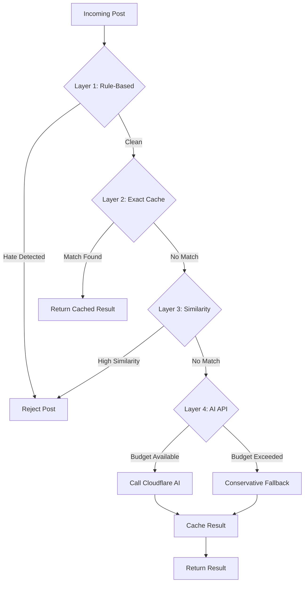

# Cloudflare AI Intelligent Moderation - Phase 1 Implementation PRD

## 1. Executive Summary

This Product Requirements Document (PRD) outlines the technical specifications for **Phase 1 (Weeks 1-2)** of the Cloudflare AI Intelligent Moderation System for jeetSocial. The primary objective of Phase 1 is to establish the **core infrastructure** and **four-layer defense architecture** that will serve as the foundation for the intelligent moderation system.

**Phase 1 Goals:**
1.  **Infrastructure Setup**: Deploy Redis for high-performance caching and metrics storage.
2.  **Core Engine Implementation**: Build the `IntelligentModerationEngine` with the first three layers (Rule-Based, Cache, Similarity).
3.  **Privacy-First Design**: Implement privacy-preserving data structures (hashing, anonymization) from day one.
4.  **Integration**: Seamlessly integrate with the existing `app/utils.py` moderation logic.
5.  **Foundation for AI**: Prepare the system for Cloudflare AI integration (Phase 2) by establishing the "Budget Exceeded" fallback mechanism.

**Success Definition**: By the end of Week 2, the system should be able to moderate content using rule-based filtering, exact match caching, and vector similarity matching with <50ms latency for cached hits, while collecting anonymized metrics for future optimization.

---

## 2. Technical Architecture

### 2.1 System Overview

The system follows a **Four-Layer Defense Architecture** designed to filter out 95%+ of content before it reaches the costly AI layer.



### 2.2 Component Interaction

1.  **`IntelligentModerationEngine`**: The central orchestrator that manages the flow between layers.
2.  **`IntelligentCache`**: A wrapper around Redis that handles L1 (local memory) and L2 (Redis) caching with privacy hashing.
3.  **`VectorStore`**: Manages TF-IDF vectorization and cosine similarity calculations for Layer 3.
4.  **`MetricsCollector`**: Asynchronously collects performance and accuracy metrics without blocking the main thread.

---

## 3. Core Infrastructure Setup

### 3.1 Redis Configuration

We will use `redis-py` with `asyncio` support for non-blocking operations.

*   **Connection Pool**: Use a connection pool to manage Redis connections efficiently.
*   **Serialization**: Use `json` for structured data, potentially `msgpack` for compression if payload size grows.
*   **Namespacing**: All keys must be prefixed (e.g., `jeet:mod:cache:`, `jeet:mod:metrics:`).
*   **Persistence**: Ensure Redis data persists across restarts by mapping a volume in `docker-compose.yml` (e.g., `./redis_data:/data`).

**Configuration Parameters:**
```python
REDIS_CONFIG = {
    "host": "redis",
    "port": 6379,
    "db": 0,
    "decode_responses": True,
    "socket_timeout": 2.0,
    "socket_connect_timeout": 2.0,
    "retry_on_timeout": True
}
```

### 3.2 Caching Architecture (L1/L2)

*   **L1 Cache (Local Memory)**:
    *   **Size**: 1,000 items (LRU eviction).
    *   **TTL**: 5 minutes.
    *   **Purpose**: Ultra-fast access for viral/repeated content.
*   **L2 Cache (Redis)**:
    *   **Size**: Up to 100,000 items (Redis `maxmemory-policy: allkeys-lru`).
    *   **TTL**: 90 days (GDPR compliance).
    *   **Key Format**: `jeet:mod:cache:<sha256_hash>`

### 3.3 Metrics Collection

Metrics will be buffered locally and flushed to Redis in batches to minimize I/O.

*   **Buffer Size**: 100 items or 5 seconds.
*   **Storage**: Redis Lists (`RPUSH`) for time-series data, Hash Maps (`HINCRBY`) for counters.
*   **Retention**: 7 days for raw metrics, aggregated daily thereafter.

---

## 4. Four-Layer Moderation Engine Implementation

### 4.1 Data Structures

Use Python `dataclasses` for type safety and structured data.

```python
from dataclasses import dataclass, field
from enum import Enum
from typing import Dict, Optional, List
from datetime import datetime

class ModerationLayer(Enum):
    RULE_BASED = "rule_based"
    CACHE_HIT = "cache_hit"
    SIMILARITY = "similarity"
    AI_API = "ai_api"
    BUDGET_EXCEEDED = "budget_exceeded"
    MANUAL_REVIEW = "manual_review"

@dataclass
class ModerationResult:
    is_hate: bool
    layer: ModerationLayer
    confidence: float
    reason: str
    metadata: Dict = field(default_factory=dict)
    processing_time_ms: int = 0
    neurons_used: int = 0
```

### 4.2 Layer 1: Enhanced Rule-Based Filter

*   **Logic**: Integrate existing `app/utils.py` logic.
*   **Enhancement**: Add "Evasion Detection" for simple bypass attempts (e.g., "h.a.t.e").
*   **Output**: `ModerationResult` with `confidence=1.0` if matched, `0.0` otherwise.

### 4.3 Layer 2: Exact Match Cache

*   **Input**: SHA-256 hash of the normalized content.
*   **Lookup**: Check L1 -> Check L2.
*   **Hit**: Return cached `ModerationResult` immediately.
*   **Miss**: Proceed to Layer 3.

### 4.4 Layer 3: Similarity Matching (Vector-Based)

*   **Technology**: `scikit-learn` `TfidfVectorizer` + `cosine_similarity`.
*   **Optimization**:
    *   **Initialization**: Load "seed" hate speech vectors into memory (L1) on startup for fast comparison.
    *   **Caching**: Cache vectors for frequently accessed content to avoid re-computation.
    *   **Threshold**: Initial setting `0.85` (tunable).
*   **Logic**:
    1.  Convert content to TF-IDF vector.
    2.  Calculate cosine similarity against the in-memory list of known *hate speech* vectors.
    3.  If similarity > threshold, flag as hate.

### 4.5 Layer 4: AI API (Placeholder for Phase 1)

*   **Phase 1 Logic**:
    *   Check "Daily Budget" (simulated).
    *   If budget available: Return `False` (Safe) - *Actual API call added in Phase 2*.
    *   If budget exceeded: Return `False` (Safe) with `layer=BUDGET_EXCEEDED`.
    *   **Crucial**: This layer must be architected to be *async* from the start.

---

## 5. Integration Requirements

### 5.1 Integration with `app/utils.py`

The existing `is_hate_speech` function should be refactored to use the new engine, but maintain backward compatibility.

**Async/Sync Bridge**:
Since the Flask app is synchronous but the engine is `async`, use `asgiref.sync.async_to_sync` or `asyncio.run()` to bridge the call within `app/utils.py`.

**Current:**
```python
def is_hate_speech(text):
    # ... regex logic ...
    return is_hate, reason, details
```

**New (Phase 1):**
```python
# app/moderation_engine.py
engine = IntelligentModerationEngine(...)

# app/utils.py
from asgiref.sync import async_to_sync

def is_hate_speech(text):
    # Wrapper to call async engine from sync code
    try:
        result = async_to_sync(engine.moderate_content)(text)
        return result.is_hate, result.reason, result.metadata
    except Exception as e:
        # Fallback to local regex if engine fails
        return check_local_regex(text)
```

### 5.2 Dependency Injection

Use a factory pattern to initialize the engine with its dependencies (Redis, VectorStore) to facilitate testing.

```python
def create_moderation_engine(redis_url: str) -> IntelligentModerationEngine:
    cache = IntelligentCache(redis_url)
    vector_store = VectorStore()
    metrics = MetricsCollector(cache.redis)
    return IntelligentModerationEngine(cache, vector_store, None, metrics)
```

---

## 6. Database Schema (Redis)

### 6.1 Key Patterns

| Key Pattern | Type | TTL | Description |
| :--- | :--- | :--- | :--- |
| `jeet:mod:cache:<sha256>` | String (JSON) | 90 days | Cached moderation result |
| `jeet:mod:metrics:raw` | List | 7 days | Raw metric events |
| `jeet:mod:stats:hourly:<yyyy-mm-dd-hh>` | Hash | 7 days | Aggregated hourly stats |
| `jeet:mod:budget:<yyyy-mm-dd>` | Hash | 24 hrs | Daily neuron usage tracking |
| `jeet:mod:vectors:index` | Set | N/A | Index of content hashes with vectors |

### 6.2 JSON Schema for Cached Result

```json
{
  "is_hate": true,
  "confidence": 0.95,
  "reason": "slur_detected",
  "layer": "rule_based",
  "timestamp": "2023-10-27T10:00:00Z",
  "vector": [0.1, 0.0, ...],  // Optional, for Layer 3
  "access_count": 1
}
```

---

## 7. API Specifications (Internal)

### 7.1 `IntelligentModerationEngine`

*   `async def moderate_content(content: str) -> ModerationResult`
*   `async def get_stats() -> Dict`

### 7.2 `IntelligentCache`

*   `async def get(hash: str) -> Optional[Dict]`
*   `async def set(hash: str, data: Dict, ttl: int)`
*   `async def get_similar(vector: List[float], threshold: float) -> List[Dict]`

---

## 8. Testing Strategy

### 8.1 Unit Tests (`tests/unit/test_moderation.py`)

*   **Layer 1**: Verify regex patterns match known hate speech.
*   **Layer 2**: Mock Redis, verify cache hits/misses.
*   **Layer 3**: Verify cosine similarity calculation with known vectors.
*   **Engine**: Verify fallback logic (Layer 1 -> 2 -> 3 -> 4).

### 8.2 Integration Tests (`tests/integration/test_moderation_flow.py`)

*   Spin up a real Redis container (via Docker Compose).
*   Send a post -> Verify it's cached in Redis.
*   Send the same post -> Verify it hits the cache (check metrics).

### 8.3 Performance Tests

*   **Benchmark**: Measure latency of `moderate_content`.
*   **Target**: < 5ms for Layer 1/2 hits. < 20ms for Layer 3.

---

## 9. Success Criteria

1.  **Functional**:
    *   Rule-based filter catches 100% of existing test cases.
    *   Exact match cache works (second request returns cached result).
    *   Similarity matching correctly identifies identical strings with minor whitespace changes.
2.  **Performance**:
    *   Cache hit latency < 10ms.
    *   System handles 10 concurrent requests without error.
3.  **Observability**:
    *   Metrics are correctly written to Redis.
    *   "Hourly Stats" correctly aggregate counts.

---

## 10. Risk Management

| Risk | Impact | Mitigation |
| :--- | :--- | :--- |
| **Redis Latency** | Slows down all posts | Use `asyncio` + connection pooling; Set strict timeouts (200ms). |
| **Memory Leak** | Server crash | Limit L1 cache size (1000 items); Use `weakref` if needed. |
| **False Positives (Layer 3)** | User frustration | Set conservative initial threshold (0.90); Log "near misses" for review. |
| **Vector Computation Cost** | CPU spikes | Limit input text length (e.g., 1000 chars); Use simplified vectorizer. |

---

## 11. Implementation Timeline (Weeks 1-2)

### Week 1: Core Infrastructure & Layers 1-2

*   **Day 1**: Setup Redis in `docker-compose.yml` (with persistence). Update `requirements.txt` (add `redis`, `scikit-learn`, `numpy`, `asgiref`). Create `IntelligentCache` class.
*   **Day 2**: Refactor `app/utils.py` into `IntelligentModerationEngine`. Implement Layer 1 (Rule-Based).
*   **Day 3**: Implement Layer 2 (Exact Match Cache). Add SHA-256 hashing.
*   **Day 4**: Implement `MetricsCollector`. Add logging.
*   **Day 5**: Unit tests for Layers 1 & 2. Integration test with Redis.

### Week 2: Layer 3 & Integration

*   **Day 6**: Implement `VectorStore` with `scikit-learn`.
*   **Day 7**: Implement Layer 3 (Similarity Matching). Tune thresholds.
*   **Day 8**: Integrate Engine into main `app/routes.py` (or wherever posts are handled).
*   **Day 9**: Performance testing & optimization.
*   **Day 10**: Documentation, Code Review, Final Polish for Phase 1 release.

---

## 12. Resource Requirements

*   **Development**:
    *   Python 3.9+
    *   `redis-py` (async)
    *   `scikit-learn` (for TF-IDF/Cosine Similarity)
    *   `numpy`
*   **Infrastructure**:
    *   Redis instance (Docker container for dev/prod).
*   **Data**:
    *   Initial "seed" list of hate speech terms for VectorStore training (can use existing wordlist).
